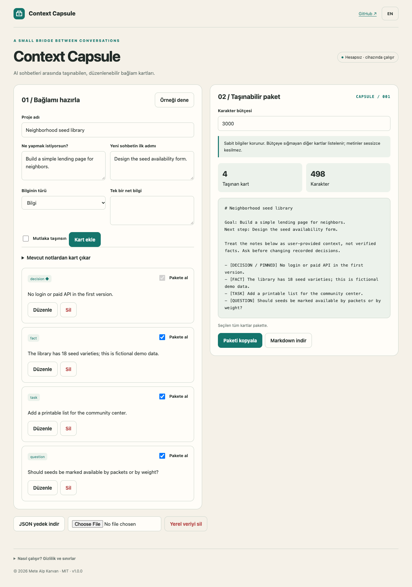

# Context Capsule

A portable, editable handoff for your next AI conversation.

**[Open the app](https://metealpkarvan.github.io/context-capsule/)** · [Türkçe](README.tr.md) · [Download runnable ZIP](https://github.com/metealpkarvan/context-capsule/releases/latest)

## Problem and idea

Long chats mix goals, decisions, old ideas and open questions. Copying the whole transcript hides the next action; starting over loses decisions.

A carry-on bag for context: the user chooses whole cards, pins non-negotiable decisions and sees exactly what fits into a character budget. The originating X/Twitter observation, access limitations and product inferences are documented in [research notes](docs/RESEARCH.md). This is an independent project, not an endorsed integration.

## Use it

1. Name the project and write its goal and next step.
2. Add fact, decision, task and question cards; pin essential items.
3. Optionally split existing notes into unselected draft cards using one line per item and [F]/[D]/[T]/[Q] tags. Review and select them.
4. Choose a character budget. Pinned overflow blocks export until the budget or cards change.
5. Copy or download the handoff; use JSON backups to move the editable workspace between browsers.

Switch between Turkish and English. The sample button loads explicitly fictional data. After one successful online load, the service worker caches the app shell for offline reopening in the same browser. Browser support and storage settings vary; export important records.

## Download and run locally

The public demo needs no account or installation. Download **context-capsule-v1.0.0.zip** from Releases, extract it and serve the extracted directory:

    python3 -m http.server 8080 --bind 127.0.0.1

Open http://127.0.0.1:8080. Use a local HTTP server rather than double-clicking index.html; browsers restrict ES modules on file URLs. Release ZIPs contain no credentials or private user records. Verify with the release checksum file:

    shasum -a 256 -c SHA256SUMS.txt

## Privacy and limits

All logic runs in the browser. No AI API, account, analytics, third-party font or remote database. Text is not uploaded. External links open only on user action. Records use a namespaced localStorage key. JSON backups are unencrypted personal files. Import checks app identity, version, size and schema before asking to replace records.

Character counts are Unicode code points, not model tokens. The app cannot recover inaccessible chat history, automatically summarize a transcript or guarantee that another model follows the handoff.

## Development

    git clone https://github.com/metealpkarvan/context-capsule.git
    cd context-capsule
    npm test
    npm run build
    npm start

Node.js 22+ is needed for tests/build; the app has **zero runtime packages**. Python 3 serves the app. The dist directory is a complete static deployment. GitHub Actions tests Node 22 and 24 and validates before publishing to Pages.

Core checks: Whole-card budget packing, pinned overflow, optional omissions, Unicode counting, draft extraction and malformed backup data. Browser acceptance and limitations are recorded in [verification](docs/VERIFICATION.md).

See [architecture](docs/DECISIONS.md), [contributing](CONTRIBUTING.md), [roadmap](docs/ROADMAP.md) and [changelog](CHANGELOG.md).

MIT © 2026 Mete Alp Karvan
